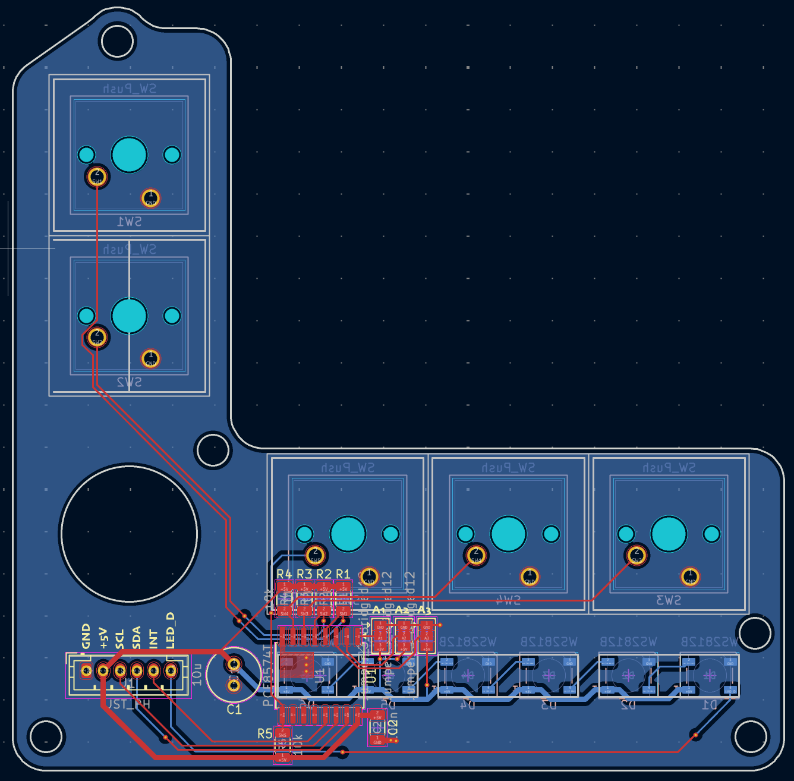

### 14/07/2025
**Log 1:** After two weeks of holidays, I realized that this project would be significantly improved by using sliding potentiometers instead of rotary encoders. I would mean more complex software to check any discrepancies between the actual "real" locomotive speed and the potentiometer's position and make any previous work obsolete, but I think this extra work would definitely be worth it. You can read the journal entries of the old concept [here](./assets/journal/JOURNAL_OLD.md).

Furthermore, I think using a shared display for both throttles should bring the price on the component side down by quite a bit.

That’s why I developed this concept: a 100x100mm control board in the center (to keep JLCPCB prices low) and two identical modules on the sides. The top cover will be made from aluminum PCBs. This allows for nicely printed icons to describe each button's function and make the finished project feel a lot more polished in contrast to a simple 3D-printed cover.

To keep wiring inside the throttle minimal, a PCB with an I²C I/O expander will be positioned under each module. I'm still a bit unsure if I can fit the main electronics (MCU, RJ45 ports, etc.) on the PCB under the central module. If not, it will require another separate board stacked on top of the mentioned central module's PCB.

Because I now need aluminium panels both for the central board and the side modules (each ~$4 + shipping) as well as PCBs for the switches, etc. (each ~$2 + shipping), it will probably end up more expensive than the first idea.

Time spent: 0.5h - Total: 0.5h

**Log 2:** With the general layout figured out, I started working on the CAD. The general methods will be similar to the previous version but still be a blank sheet design. The whole assembly will be a pretty complex sandwich: Aluminum cover – top plate (to hold the switches and display) – bottom plate (to hold the PCB) – base.
I started work on the the display module because it was the most specified part: 

I found [this](https://de.aliexpress.com/item/1005006160620381.html) good looking LCD with a pretty small footprint for it’s ~2.5in screen size. And there’s even a [CAD model](https://grabcad.com/library/gmg12864-06d-1) for it.
Time spent: 2.5h - Total: 3h

**Log 3:** Now I could build the top plate around the display module. It's main job is to hold the key switches and a specific distance so that they don’t protrude by like 50mm over the top cover. The three holes on the bottom will display the status of stuff like track power.

Time spent: 4h - Total: 7h

### 16/07/2025
**Log 4:** After refining the top plate a bit, I created the bottom one. It screws into the top plate using M3 screws and will house a PCB. Because the plates are split it can be easily 3D-printed.
Time spent: 2h - Total: 9h

**Log 5:** I could now export the PCB’s outline from Fusion into KiCad and start working on the PCB. It turns out it is way too small to contain all main electronics (that includes two RJ45 ports!). The board will have a PCA8574 I/O expander and connect to the main control board with an eight-pin JST-PH connector: GND – +5V – SCL – SDA – Interrupt – LED_DATA.

Time spent: 4h - Total: 13h

### 17/07/2025
**Log 6:** Today I created the first screen. It was surprisingly easy using this tool I found: [Lopaka](https://lopaka.app/editor/11258/23701). The next step is to make it interactive.

Time spent: 0.5h - Total: 13.5h

**Log 7:** I copied the generated code into wokwi and made it controllable using two potentiometers. This all went well until I tried including a CAN library. The 328p doesn‘t have enough RAM the application.

Time spent: 2h - Total: 15.5

### 18/07/2025
**Log 8:** After finding out that the RAM of the ATmega 328p is by far not enough to hold both the u8g2 and CAN libraries, I chose the ESP32-S3-WROOM-1U as a new MCU. I believe it is the only easily accessible MCU that can be hand-soldered as a module. Of course I have to rework the already finished control PCB schematic.
Creating a basic schematic for such an ESP32 module is quite a bit simpler than for the 328p (no clock, etc.). It also supports programming over USB, which will make the development process a lot simpler.
I now only have to connect the GPIO pins to the ESP32. Which pins to use can be determined based on the PCB layout.

Time spent: 3.5h - Total: 19h

### 19/07/2025
**Log 9:** I’m finished creating the control PCB 🎉! It was probably the most pain full PCB to layout because the space was so restricted. But in the end I managed to fit it all on two layers. All pins I didn’t use are accessible on those amazing WAGO 2601 terminals and can be used for e.g. additional switches on a control panel. In the end the left over pins where only ten, but this should be enough for at least some small layouts.

Time spend: 5h - Total: 24h

**Log 10:** I struggled a bit with the side panels. Both have to be exactly symmetrical to reduce part cost (for the top covers and PCBs). I wanted to put one or two switches below the sliding potentiometer (60mm of travel) but this didn’t fit on the max. 100x100mm I could use (I would have to a 45mm potentiometer but this felt a but small). In the end I decided to add two switches with corresponding lights on each side of the potentiometer.

Time spent: 2h - Total: 26h

### 20/07/2025
**Log 11:** Ok, never mind, I managed to fit two buttons beneath the sliding potentiometer. It looks infinitely better! It’s a similar design to the center module with its two plates that get mounted on top of each other to guarantee good tolerances for mounting the switches (as opposed to printing overhangs with supports).

Time spent: 1.5h - Total: 27.5h

**Log 12:** I also quickly put together the PCB for the side modules. It’s really simple as it contains no chip.

Time spent: 1h - Total: 28.5h

### 21/07/2025
**Log 13:** I worked on the base today. I had to cut it in half because the entire thing would be larger than 180 × 180 mm. I also divided it vertically so that it could be printed without supports; now, it resembles the plates’ sandwich design. All is screwed together using M3 screws and inserts.

I also started the first test prints. They came out pretty nice; just forgot to add holes to mount the center cover.

Time spent: 4.5h - Total: 33h

### 23/07/2025
**Log 14:** The base still needs a bit of work. There were a few clearance problems with the top plates as well as the display. I now moved the control PCB from the center to the left so the base body can be split more easily to fit on my A1 mini. I also created a simple bottom cover. The only thing that’s still left is the top cover.

Time spent: 1.5h - Total 34.5h

**Log 15:** And I finished the top cover! I imported some nice icons from [PhosphorIcons](https://phosphoricons.com/) into KiCAD. The cover is secured with M2 bolts into the top plates. Maybe the holes can be countersunk at home to have a flush finish. I think that’s all for CAD, just documentation left…

Time spent: 2.5 - Total: 37h
