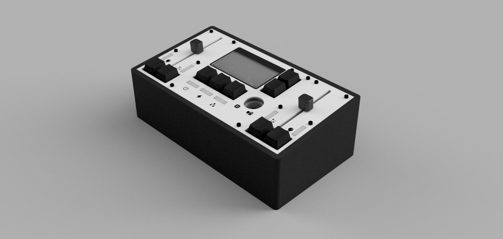
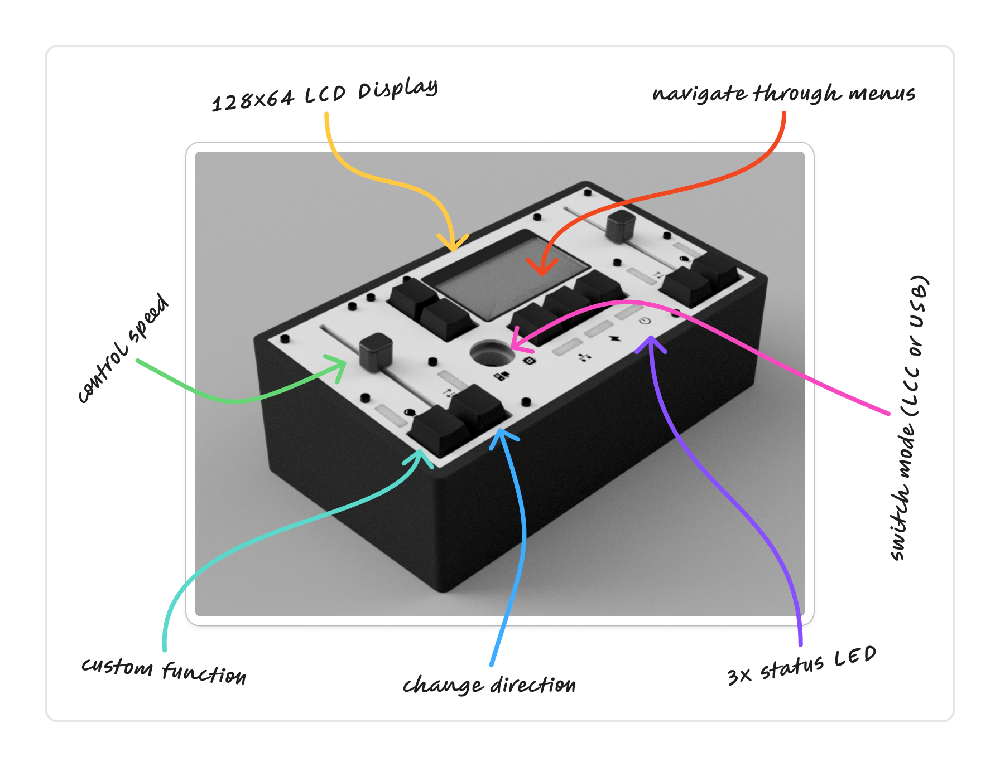

# *doppeltraktion*

Doppeltraktion (German for double heading — that's when two locomotives pull together on a train) is the world's simplest model railway throttle. It has ≈6x fewer buttons and switches than market competitors, such as the Uhlenbrock Intellibox II... It connects to your model railroad using LCC or to your computer via USB to control software such as RocRail or JMRI*¹ and can control two locomotives simultaneously.  
*¹ not yet implemented

### Functions

### What is LCC?

LCC is a relatively new standard by the NMRA to control devices using a CAN bus. It's completely free and open-source, unlike alternatives like LocoNet, which comes with a pretty hefty licensing fee for device manufacturers.

### Motivation

I've been building on my model railway from an early age. As time progressed, the electronics and operations became so complicated that nobody else could really control it. That's why I always wanted to build a physical throttle that's not dependent on external computers or phones. Everything should be ready to use when you turn on the power. Of course, there are alternatives from big manufacturers, such as the mentioned Intellibox or the ESU ECoS, but these devices are very expensive (500€+) and aren't compatible with my DIY DCCEX base station.

### Assembly

1. Print all necessary parts: 2x [top side plate](./production/3d/top_side_plate.stl), 2x [bottom side plate](./production/3d/bottom_side_plate.stl), 1x [top center plate](./production/3d/top_center_plate.stl), 1x [bottom center plate](./production/3d/bottom_center_plate.stl), 1x [top left base](./production/3d/top_base_left.stl), 1x [top right base](./production/3d/top_base_right.stl), 1x [bottom left base](./production/3d/bottom_base_left.stl), 1x [bottom right base](./production/3d/bottom_base_right.stl), 1x [bottom left cover](./production/3d/bottom_cover_left.stl), 1x [bottom right cover](./production/3d/bottom_cover_right.stl). (I know these names are awful, but I couldn‘t come up with better ones.)

2. Insert the heat-set inserts into their respective holes.

3. Mount all the PCBs and solder the switches in place.

4. You can now secure the plates onto the top base. With the control board mounted on the bottom base, it can also be secured to the top base.

5. Now is the time to run the wires from the modules (2x side, 1x center) and the display to the control board. Also, wire up the selector knob to the WAGO terminals and ground.

6. The final step is to screw both the top cover (the aluminium one) and the bottom cover onto the construction.

### BOM

|Part                     |Manufacturer               |Product                             |Quantity|Price each|Total Price|Link                                                                                                                                    |
|-------------------------|---------------------------|------------------------------------|--------|----------|-----------|----------------------------------------------------------------------------------------------------------------------------------------|
|Inserts                  |YMAX                       |Brass Threaded Insert Nut Kit       |1       | $1.460   | $1.46     |[Link](https://www.aliexpress.com/item/1005006472962973.html)                                                                                   |
|Display                  |EstarDyn                   |12864-06D                           |1       | $6.250   | $6.25     |[Link](https://www.aliexpress.com/item/1005006160620381.html)                                                                                   |
|Rotary Knob              |Sweideer                   |LA-155C                             |1       | $2.630   | $2.63     |[Link](https://www.aliexpress.com/item/1005007495183351.html)                                                                                   |
|Switches                 |-                          |10 Pieces Keyboard Replacement Parts|1       | $1.590   | $1.59     |[Link](https://www.aliexpress.com/item/1005004341695529.html)                                                                                   |
|Keycaps                  |-                          |B0KA 20PCs PBT Blank                |1       | $4.470   | $4.47     |[Link](https://www.aliexpress.com/item/1005004525231272.html)                                                                                   |
|M2x5 12x                 |SCREWHOME                  |50pcs M2x5mm ULTRATHIN              |1       | $1.460   | $1.46     |[Link](https://www.aliexpress.com/item/1005005070119421.html)                                                                                   |
|M2x10 4x                 |LIYA                       |50pcs M2x10mm                       |1       | $1.560   | $1.56     |[Link](https://www.aliexpress.com/item/32810872544.html)                                                                                        |
|M3x20 2x                 |LIYA                       |50pcs M3x20mm                       |1       | $2.760   | $2.76     |[Link](https://www.aliexpress.com/item/32810872544.html)                                                                                        |
|M3x8 8x                  |LIYA                       |50pcs M3x8mm                        |1       | $1.730   | $1.73     |[Link](https://www.aliexpress.com/item/32810872544.html)                                                                                        |
|M3x8 Countersunk 8x      |ZONST                      |50pcs M3x8mm Countersunk            |1       | $1.810   | $1.81     |[Link](https://www.aliexpress.com/item/1005002333132596.html)                                                                                   |
|M3x12 12x                |LIYA                       |50pcs M3x12mm                       |1       | $2.060   | $2.06     |[Link](https://www.aliexpress.com/item/32810872544.html)                                                                                        |
|M3x10 5x                 |LIYA                       |50pcs M3x10mm                       |1       | $1.940   | $1.94     |[Link](https://www.aliexpress.com/item/32810872544.html)                                                                                        |
|ESP32-S3                 |EXPRESSIF                  |ESP32-S3-WROOM-1U-N16R2             |1       | $5.660   | $5.66     |[Link](https://lcsc.com/product-detail/WiFi-Modules_ESPRESSIF-ESP32-S3-WROOM-1U-N16R8_C3013946.html)                                            |
|LDO                      |Advanced Monolithic Systems|AMS1117-3.3                         |5       | $0.170   | $0.85     |[Link](https://lcsc.com/product-detail/Voltage-Regulators-Linear-Low-Drop-Out-LDO-Regulators_Advanced-Monolithic-Systems-AMS1117-3-3_C6186.html)|
|CAN transceiver          |NXP                        |TJA1051T,118                        |1       | $0.960   | $0.96     |[Link](https://lcsc.com/product-detail/CAN-Transceivers_NXP-TJA1051T-118_C18387.html)                                                           |
|I/O expander             |HGSEMI                     |PCF8574T/TR                         |1       | $0.790   | $0.79     |[Link](https://lcsc.com/product-detail/I-O-Expanders_HGSEMI-PCF8574T-TR_C2987288.html)                                                          |
|4 pin connector          |JST                        |B4B-PH-K-S(LF)(SN)                  |10      | $0.041   | $0.41     |[Link](https://lcsc.com/product-detail/Wire-To-Board-Connector_JST-B4B-PH-K-S-LF-SN_C131334.html)                                               |
|6 pin connector          |JST                        |B6B-PH-K-S(LF)(SN)                  |10      | $0.067   | $0.67     |[Link](https://lcsc.com/product-detail/Wire-To-Board-Connector_JST-B6B-PH-K-S-LF-SN_C131342.html)                                               |
|9 pin connector          |JST                        |B9B-PH-K-S(LF)(SN)                  |5       | $0.051   | $0.26     |[Link](https://lcsc.com/product-detail/Wire-To-Board-Connector_JST-B9B-PH-K-S-LF-SN_C157968.html)                                               |
|4 pin connector housing  |JST                        |PHR-4                               |50      | $0.016   | $0.79     |[Link](https://lcsc.com/product-detail/Housings-Wire-To-Board-Wire-To-Wire_JST-PHR-4_C111514.html)                                              |
|6 pin connector housing  |JST                        |PHR-6                               |20      | $0.020   | $0.40     |[Link](https://lcsc.com/product-detail/Housings-Wire-To-Board-Wire-To-Wire_JST-PHR-6_C157952.html)                                              |
|9 pin connector housing  |JST                        |PHR-9                               |20      | $0.036   | $0.72     |[Link](https://lcsc.com/product-detail/Housings-Wire-To-Board-Wire-To-Wire_JST-PHR-9_C157949.html)                                              |
|Connector contact        |JST                        |SPH-002T-P0.5S                      |100     | $0.008   | $0.80     |[Link](https://lcsc.com/product-detail/Housing-Contact_JST-SPH-002T-P0-5S_C111515.html)                                                         |
|USB-B port               |TE Connectivity            |292304-1                            |1       | $0.470   | $0.47     |[Link](https://lcsc.com/product-detail/USB-Connectors_TE-Connectivity-292304-1_C86462.html)                                                     |
|100uF capacitors         |Rubycon                    |35ZLH100MEFC6.3X11                  |10      | $0.059   | $0.59     |[Link](https://lcsc.com/product-detail/Aluminum-Electrolytic-Capacitors-Leaded_Rubycon-35ZLH100MEFC6-3X11_C109392.html)                         |
|100nF capacitors         |Samsung Electro-Mechanics  |CL31B104KBCNNNC                     |20      | $0.137   | $2.74     |[Link](https://lcsc.com/product-detail/Multilayer-Ceramic-Capacitors-MLCC-SMD-SMT_Samsung-Electro-Mechanics-CL31B104KBCNNNC_C24497.html)        |
|10kOhm resistors         |YAGEO                      |RC1206FR-0710KL                     |100     | $0.004   | $0.37     |[Link](https://lcsc.com/product-detail/Chip-Resistor-Surface-Mount_YAGEO-RC1206FR-0710KL_C132649.html)                                          |
|RJ45 port - existing     |Phoenix Contact            |1337243                             |2       | -        | -         |[Link](https://www.phoenixcontact.com/en-pc/products/rj45-pcb-connectors-cuc-sp-j1st-a-r4lt-thr-led-1337243)                                    |
|WAGO terminals - existing|WAGO                       |2601-3105                           |2       | -        | -         |[Link](https://www.wago.com/de/leiterplattenanschluss/leiterplattenklemme/p/2601-3105)                                                          |
|Slide switch - existing  |XKB Connection             |SS13E05L2                           |1       | -        | -         |[Link](https://lcsc.com/product-detail/Slide-Switches_XKB-Connection-SS13E05L2_C2884809.html)                                                   |
|Control PCB              |JLCPCB                     |                                    |1       | $1.720   | $1.72     |                                                                                                                                                |
|Side PCB                 |JLCPCB                     |                                    |1       | $3.440   | $3.44     |                                                                                                                                                |
|Center PCB               |JLCPCB                     |                                    |1       | $3.440   | $3.44     |                                                                                                                                                |
|Cover                    |JLCPCB                     |                                    |1       | $23.790  | $23.79    |                                                                                                                                                |
|JLCPCB shipping and taxes|                           |                                    |1       | $20.600  | $20.60    |                                                                                                                                                |
|LCSC shipping            |                           |                                    |1       | $9.210   | $9.21     |                                                                                                                                                |
|**Total**                |                           |                                    |        |          | $108.40   |                                                                                                                                                |
