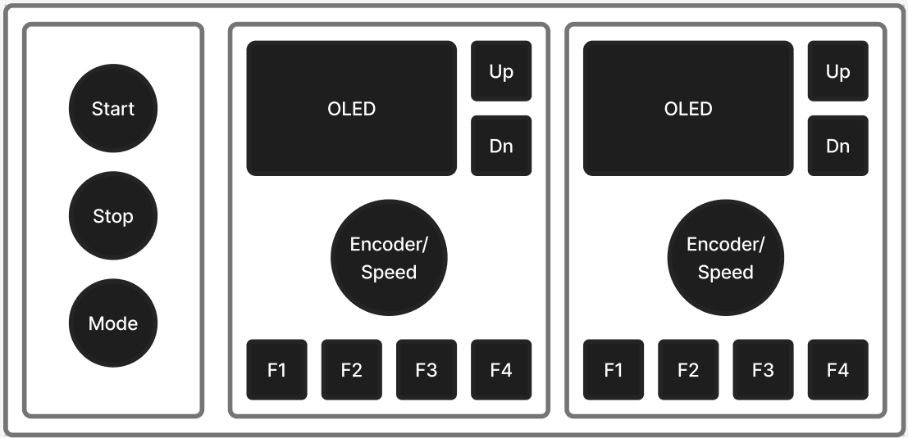
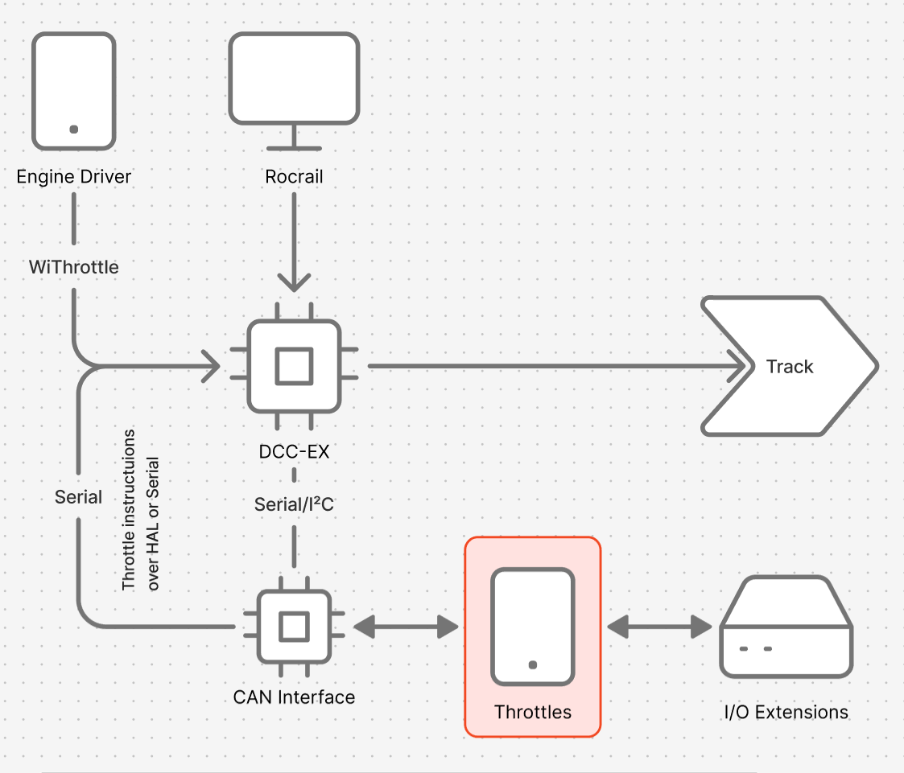
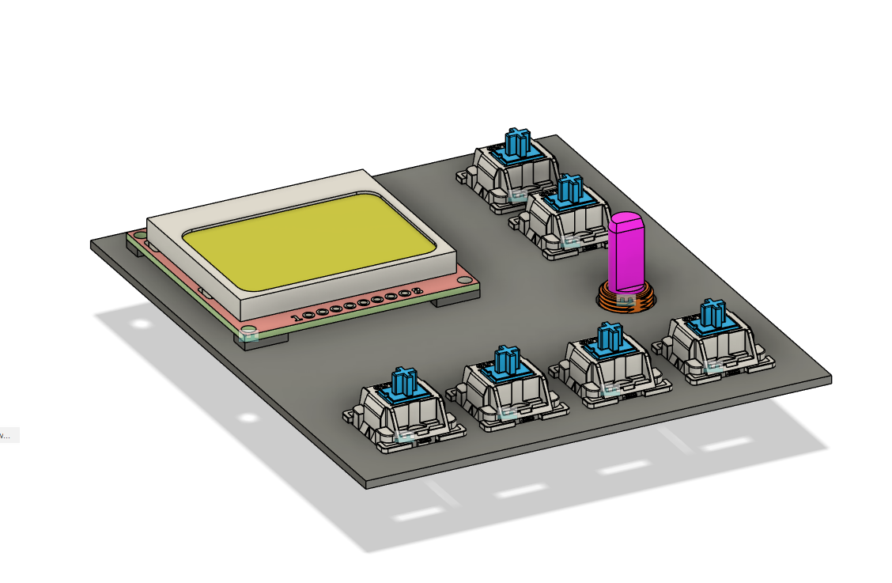
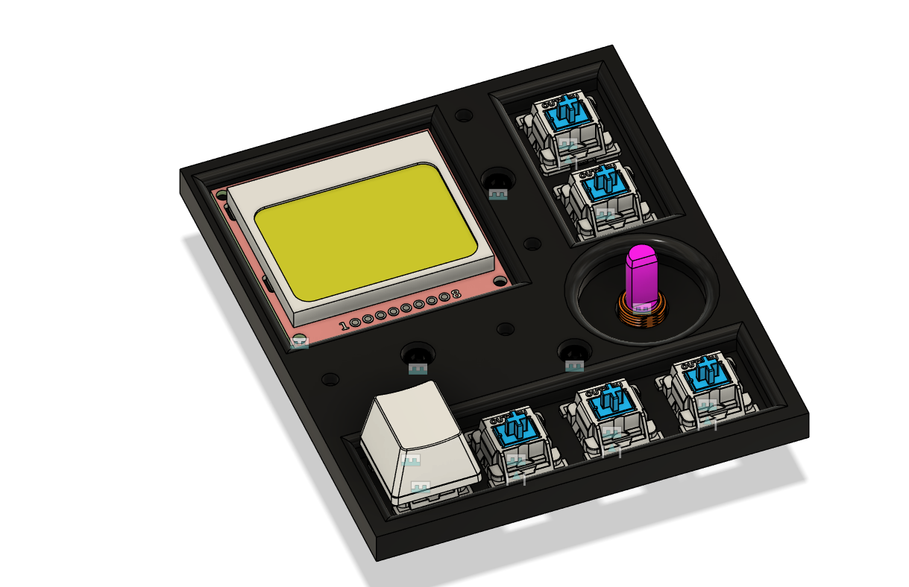
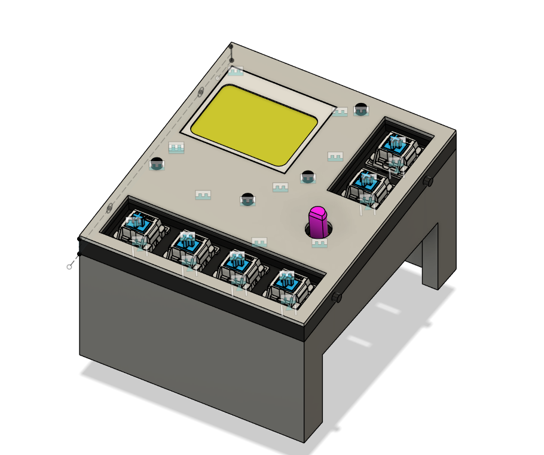
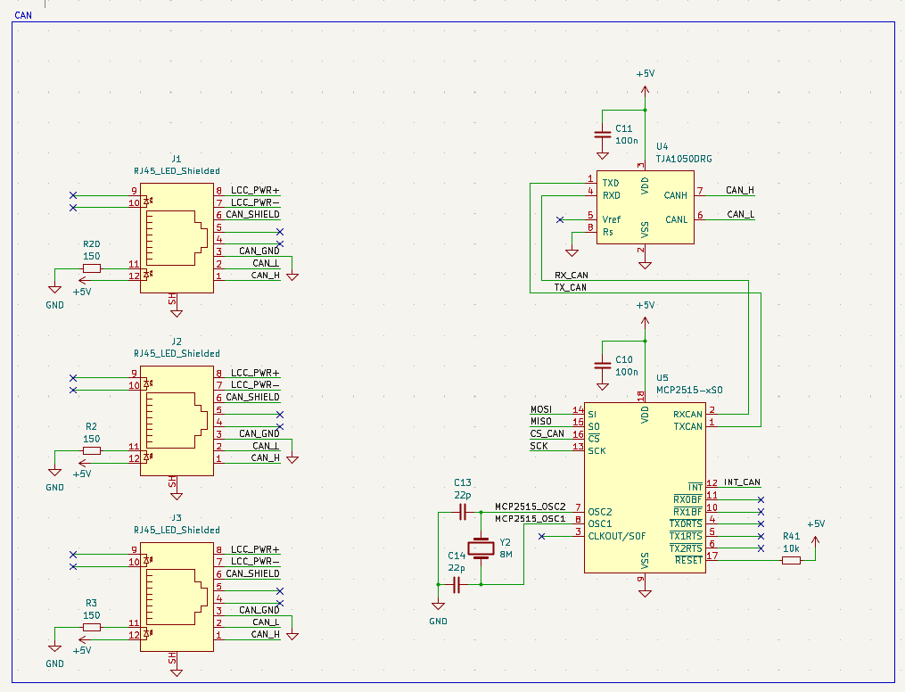
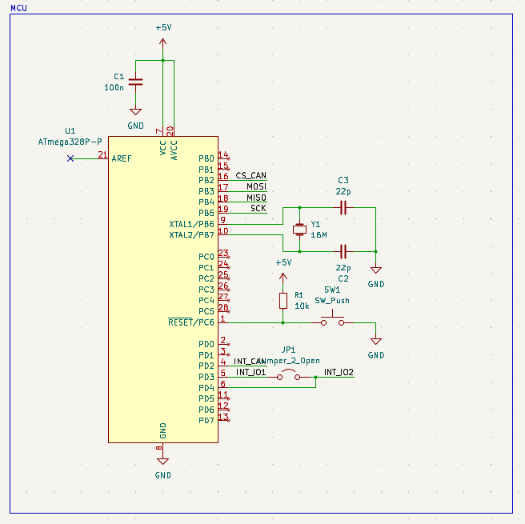
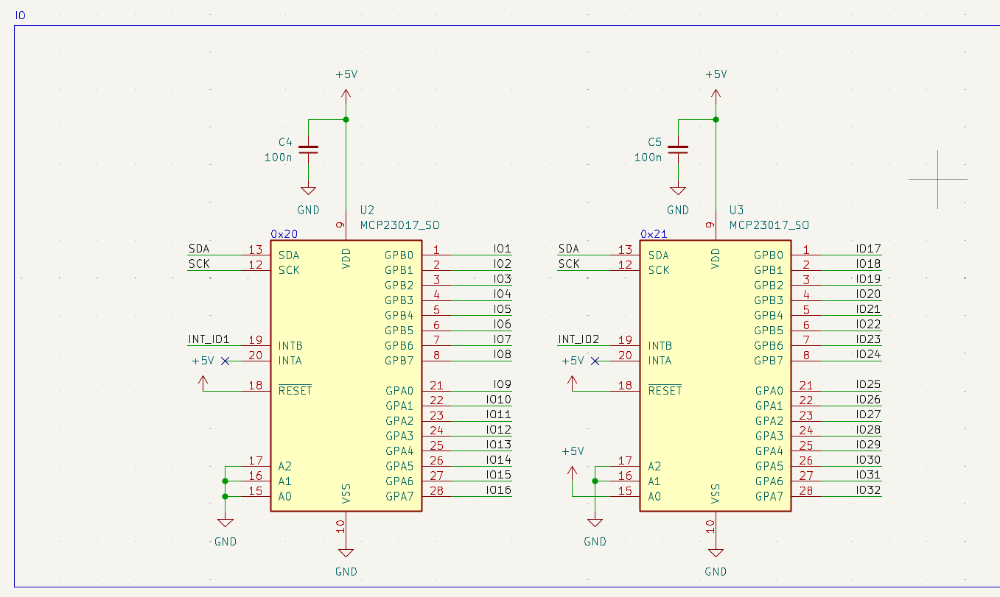
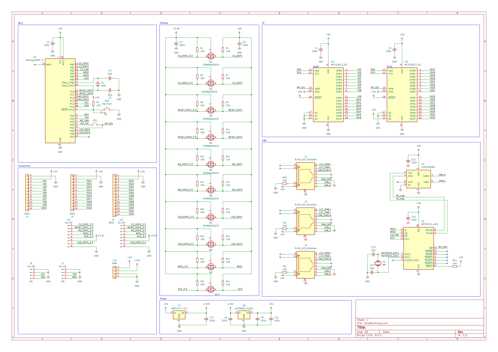
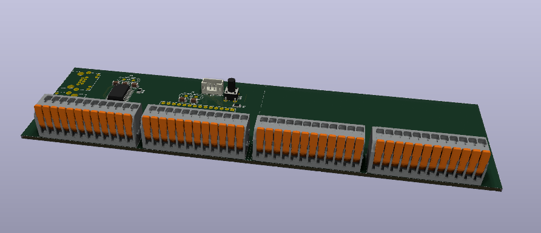

## 18/06/2025
Log 1 *(1.5h)*: 
Today I started work on the new throttle, which will be the main way to control the model railroad. It would be able to control two locomotives simultaneously and send commands over LCC/CAN to the command station (Arduino Mega running DCC-EX on a custom PCB). It uses the same LCC/CAN bus as all I/O extension boards (also custom PCBs).
The throttle itself is going to be stationary and 3d-printed. The physical parts will be modular and designed to connect to a central "throttle-PCB" .

**Throttle Design:**
**Architecture:** 

Because DCC-EX only accepts throttle commands over a separate serial port, an active CAN-Interface is required to distinguish between I/O and throttle messages and route them to different ports to the command station (DCC-EX).

## 19/06/2025
Log 2 *(2.5h)*:
I looked at different hardware options:
#### 1. MCU
I will probably use an ATmega-328p as microcontroller just because it can be easily programmed using an existing Arduino Uno and doesn’t require a separate programmer. Hopefully it has enough computing power to run two OLEDs and the CAN connection all at the same time. To be able to read ~40 inputs, shift registers have to be used.
#### 2. Inputs/Outputs

| Type    |                                                                                                                                               |
| ------- | --------------------------------------------------------------------------------------------------------------------------------------------- |
| Buttons | 12x Key Switches + Keycaps 3x 22mm  Industrial Push Buttons to turn on and off the track power and change the operating mode (auto/manual) |
| Dial    | Rotary encoder to avoid conflicts when dial position doesn’t match locomotive speed                                                           |
| Display | 2x 0.96in I²C OLEDs                                                                                                                           |
| LEDs    | multiple WS2812b-LEDs to show throttle and track status                                                                                       |
#### 3. Connectors

| Connection | Connector                                                                                    |
| ---------- | -------------------------------------------------------------------------------------------- |
| LCC/CAN    | 4x RJ45 ports - two of them can be used to connect mobile throttles **(CAN stub lenght!!!)** |
| Inputs     | ~40x Wago 2601                                                                               |
| Displays   | JST-PH or Wago 2601                                                                          |
|            |                                                                                              |
#### 4. Shift registers
The 74HC165 has been selected because of its extensive documentation.
#### 5. CAN hardware
I’ve had good results using the MCP2515 CAN controller together with the TJA1050 CAN transceiver in previous projects, so I’ll use the same setup for this one.

### Log 3 *(1.5h)*: Rough sketch
![[Throttle v1.png]]
I created a very rough sketch to check button and display dimensions of the throttle. That’s when I noticed just how small 0.96 inches are. So I’ve decided to use a 1.54in OLED.

## 20/06/2025
### Log 4 *(1h)*:
I have updated the cost estimates and decided to switch from a 1.54in OLED to a 1.3in OLED. The smaller display is approximately half the cost.

### Log 5 (3h):

I have begun working on the mounting plate. All inputs and the display are attached to it, and it's covered by a front panel (aluminum PCB).

## 21/06/2025
### Log 6 (6h)

With the base plate (basically) finished, I started working on the base piece. Its main task is to hold the PCB securely beneath the inputs. It will preferably be a pain fiddling all cables from the switches, etc. through but that’s future me’s problem.

## 23/06/2025
### Log 8: *(3h)*
I started working on the PCBs schematic. Most CAN-related parts I could easily copy from a previous project, which accelerated the process by a lot. I decided against the use of shift registers for all inputs and decided on I²C I/O expanders simply because they can call an interrupt.

### Log 9: *(1.5h)*
I further worked on the cost estimate, which now sits at ~80€. Because I already have the WAGO connectors, it’s ~20€ cheaper, so ~50€ + shipping = 70€.

## 25/06/2025
### Log 10: *(2.25h)*
Today I managed to finish the schematic. The biggest challenge was definitely the level shifters. I started with an 8-channel bi-directional shifter, but I couldn’t find one that could be hand-soldered. I therefore ended up with a simple MOSFET-based design.

## 26/06/2025
### Log 11: (2.5h)
All footprints assigned🎉🎉🎉! Because I didn’t have my KiCAD library with me, which included many of the components I used, I had to reimport and partially recreate most of them. I also got started on the rough PCB layout:

